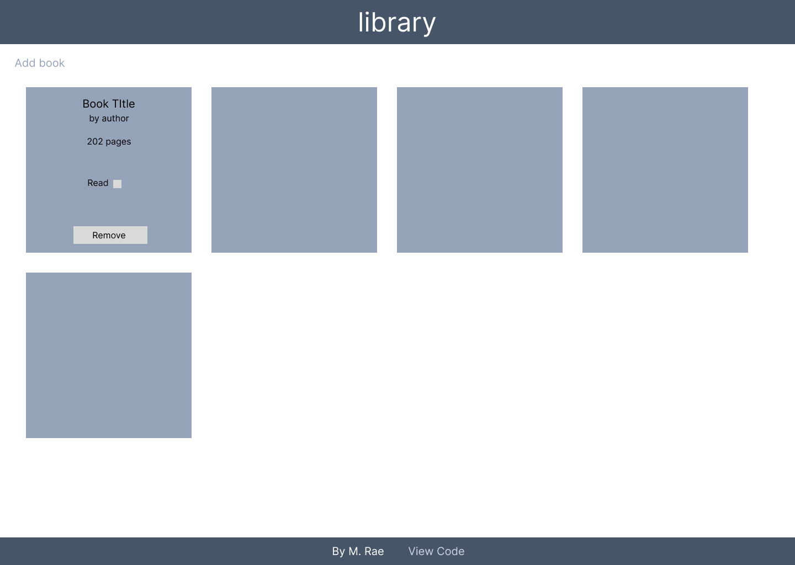

# library-app
Simple app which locally stores and displays 'Books' and their information (author, title, number of pages, and if it has been read or not).
The core user interaction with this app is adding books, removing books, and updating existing books read status.

## Design
Final design of app should be roughly as so:
